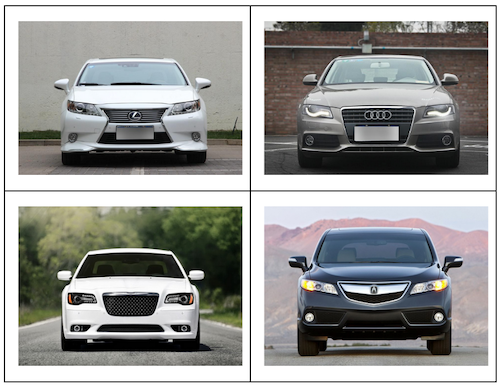

## Creating Vehicle Images with Generative Adversarial Networks

## Abstract
Generative Adversarial Networks (GANs) are an
interesting topic in the field of machine learning, they
provide the possibility for artificially generating
images, video, text, and audio. The development of a
GAN focused on generating new images of vehicles
could serve as a new point of inspiration for
automotive designers and engineers to explore new
vehicle designs in a much more efficient way. The
goal of this project is to develop a machine learning
model capable of efficiently producing new original
vehicle designs.

This project's ultimate goal of achieving that machine
learning model capable of producing vehicle images
was successful by developing a GAN that was able to
read in real images of existing vehicles and output
new designs. The final iterations of the GAN
developed in this project resulted in outputs that were
much more clearer and distinguishable compared to
the initial stages of the project.

## Problem Formulation
The goal of this project is to develop a GAN that
takes in real images of vehicles as input and generates
images that look similar or identical to the real images
as output.

## System/Algorithm Design
The GAN used in this project to create images of
vehicles has three key components, the generator
model, discriminator model, and training loop. The
image pipeline serves as the dataset from which the
discriminator compares real images of vehicles
against the images that the generator generates. The
training loop trains the generator and discriminative
models alternate training every epoch, in order to
ensure that both models ‘learn’ together gradually.

## Dataset

The dataset used to train the discriminator model
came from the Comprehensive Cars Dataset, which
includes 136,726 total images of vehicles from
different makes, models, years, colors, and angles.
The original authors of this dataset primarily
intended for this data to be used in classification
and attribute prediction problems, so the dataset
needed to be filtered in order to contain images of a
consistent angle and position.

### Example of images included in dataset

In order to allow for a reasonable total model run
time (~1-2 hours), the dataset was reduced to 1324
images of front-facing vehicles of different makes,
models, and colors. All 1324 were utilized as
training data due to the nature of how the
discriminator model trains, it does not require a test
dataset to confirm its effectiveness.

## Results
Because of the nature of the output that the GAN
produces, it is difficult to objectively calculate the
overall effectiveness of the generator and
discriminator model. For this project and model
type, the method used to evaluate the produced
images will be a subjective analysis of the output
images, comparing them to real images.
Other methods exist for calculating the quality of
the generated images, such as calculating the
Inception Score using the Inception v3 pre-trained
model, however these objective methods rely on
multiple classes and don't work well with a
small-scale single class GAN used in this project.
Multiple tests were conducted with various image
resolutions as well as model characteristics, and the
model effectiveness was determined based on how
closely output images resemble some real images.

### 64x64 pixel output example

Based on the table above, the results show a steady
improvement from epochs 1-300, with a distinct
front windshield and grille becoming visible. The
GAN appears to become stagnant after this, with
the final 200 epochs making little visible progress.

### 96x96 pixel output example

The table above shows another relatively successful
model configuration, with an outline of a white car
becoming visible at epoch 200.

### 128x128 pixel output example

In the table above, a visible vehicle outline begins
to appear at epoch 190, however the model begins
to stagnate in later epochs, producing similar or
lower quality images than before.

## Conclusion

The initial goal was to develop a GAN that takes in
real vehicle images and outputs realistic generated
images. The final output images in 64x64px, 96x96px, 
and 128x128px resolutions resulted in somewhat 
blurry and distorted yet still recognizable images 
of various vehicle front ends.

Imperfect image quality was also likely as result of a
relatively small dataset (1324 images), paired with
some inconsistent image backgrounds and angles.
Testing the same GAN on a larger and more uniform
dataset would have likely resulted in improved image
quality. The long model run time even with GPU
acceleration limited the total number of model runs
but the final model iterations still resulted in good
output that is relatively recognizable.

